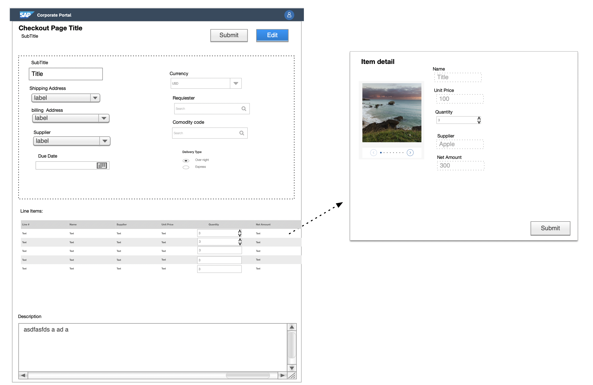

# Poc Checkout

The goal is to evaluate a usage of native Angular components vs UI5 WebComponent in Angular Environment and spot any drawbacks that could impact 
overall customer experience. Plus trying provide constructive feedback to both Fundamentals-ngx and  UI5WC community in order plan together potential 
improvements. 

UI5 Web Components provides solid building blocks that can be  seamlessly integrated with any Angular application without 
any additional overhead. What we will be focusing on is mainly performance namely these KPI:

Initial page load metrics:
 * Page load time 
 * Time to visual render 
 * Number of requests 
 * Data Transferred (compressed) 
 * Data Resources (uncompressed)
 
The app will be divided into two types small application and large application. 
 
 
 
 
 ### Common requirements
 
 * Use only components that exists in both libraries  
 * Load data from local json to populate the page as well as controls
 * Line Items will have 100 records
 * SmallApp is this one page above. Large app will have this identical page copied over 5 Tabs on one page.
 
 
 
 
   

 
    

